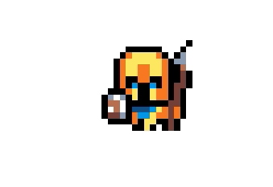
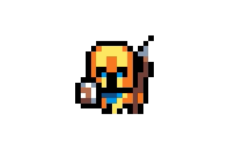
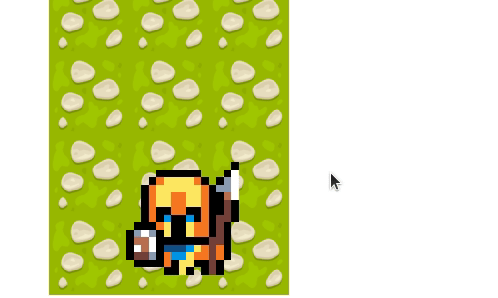
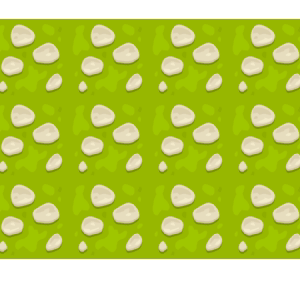

## Lightning Bolt 2D Game/Engine


Project Bolt
======
Simple Kotlin 2D strategy game, with an attempt 
to write the base of it as a universal game engine base I can use for further projects.

#### Screenshot


## Download

## Usage
Simply run gradle to create 
```Code
gradle run
```
## Contributors

### Contributors on GitHub
* I am happy to receive suggestion, however this project is mostly for my amusement 
and learning only so I might ignore 

### Translations
*

### Third party libraries
*

## License
* GPL v3.0

## Version History
* 0.0.1: Basic Init and render loop


* 0.0.2: Basic Sprite animations and creation factory


* 0.0.3: Each game object holds an entire map of sprites with enumms as keys directing a what current animation should be played


* 0.0.4: A basic board and layers are now rendering, however it is very crude 


## How-to use this code
*

## Contact
#### Developer/Company
 Homepage: www.miloszjakubanis.com
 e-mail: milosz.jakubanis@protonmail.com

